# Lab week tuan 6
### Đề bài 
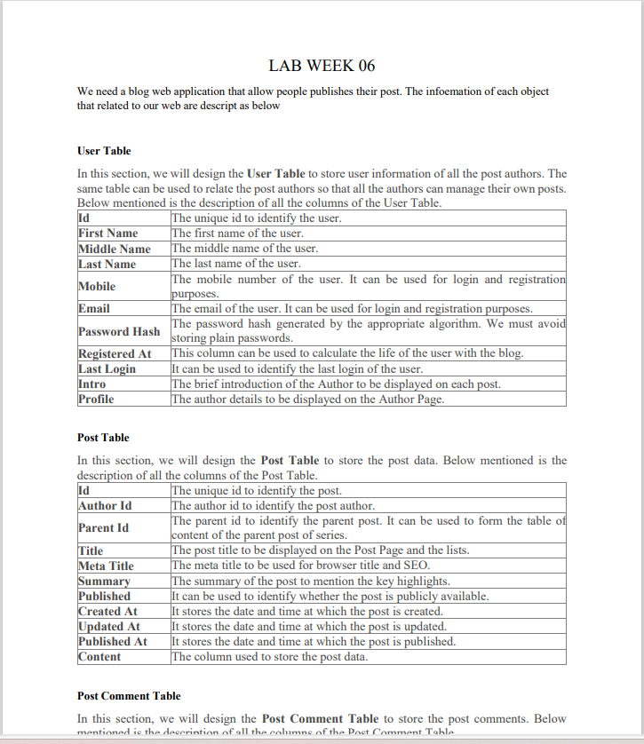
### hình ảnh cơ sở dữ liệu 

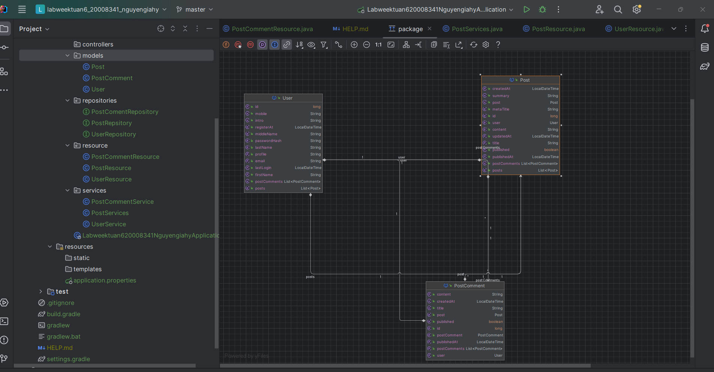

### Chức năng đăng ký 
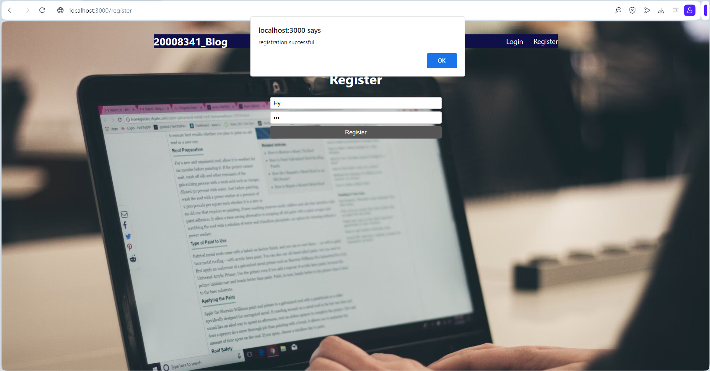

### chức năng đăng nhập 
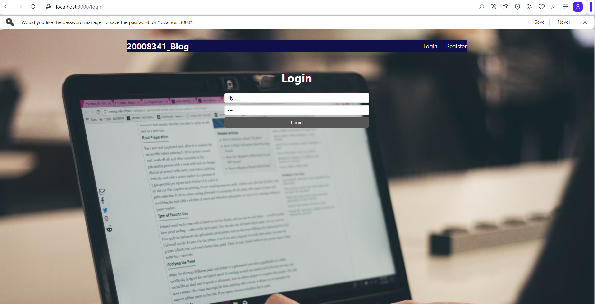

### lần đầu đăng nhập chưa có blog nào thì sẽ có chức năng tạo blog 
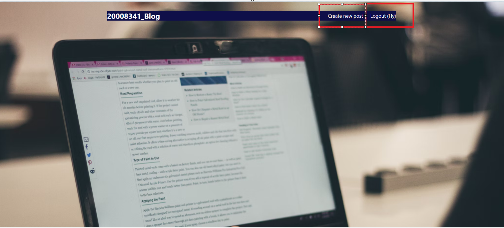

### tạo blog
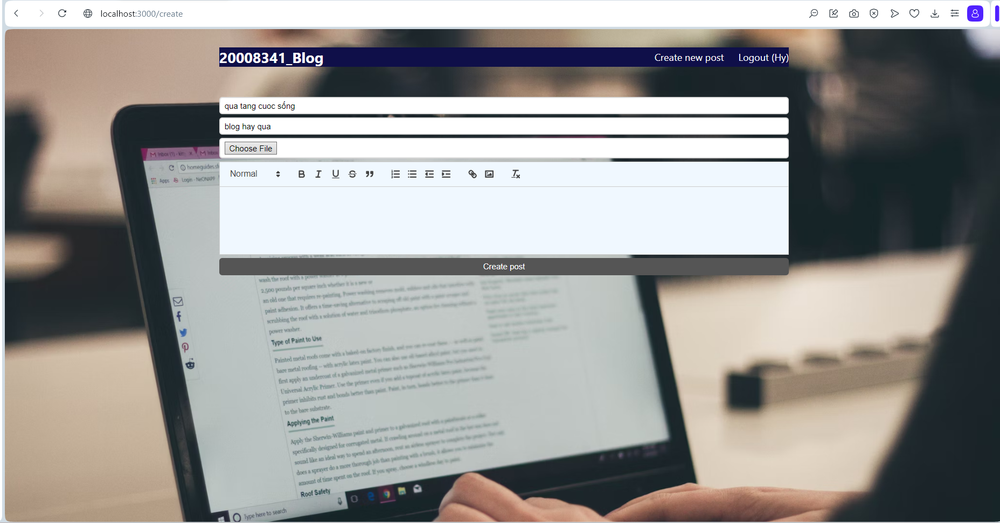
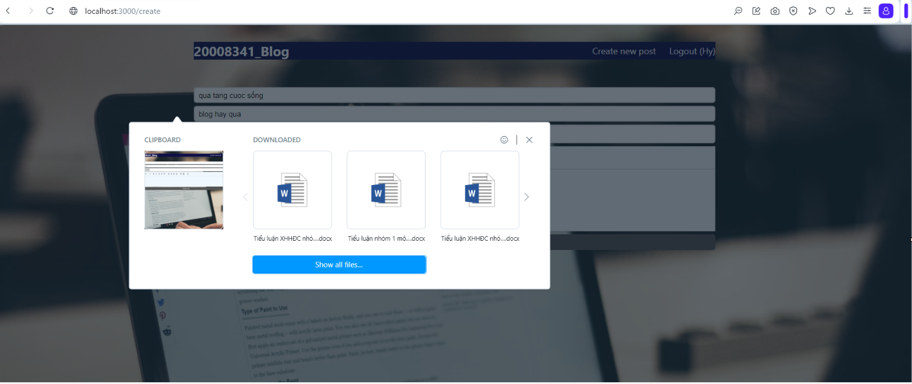

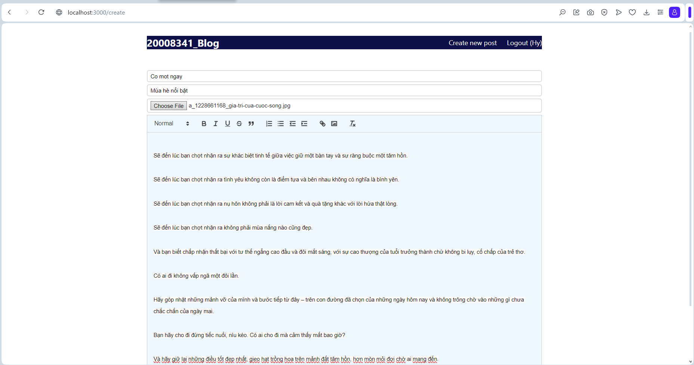

### danh sách blog
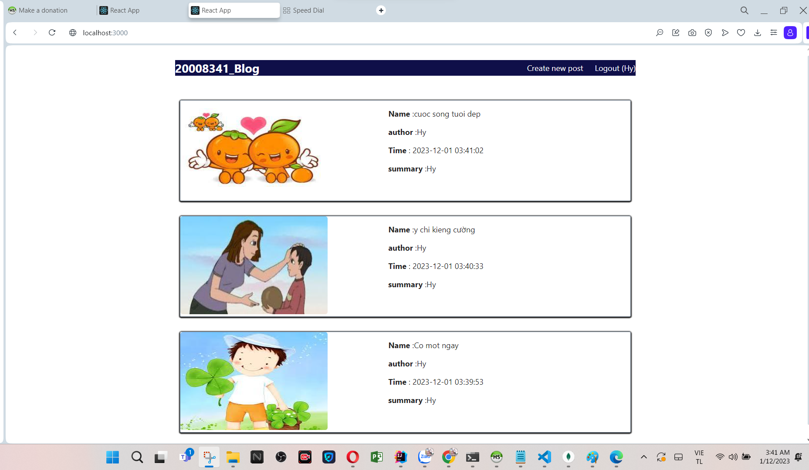

### xem và  edit blog cua mình
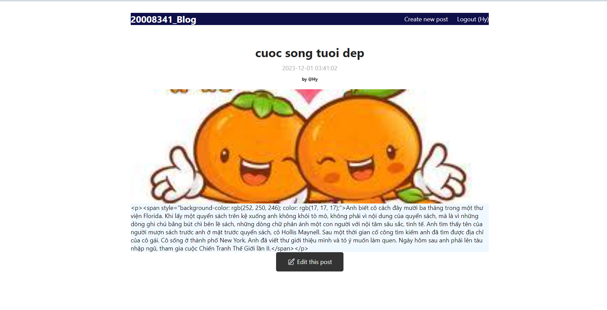

### update blog 
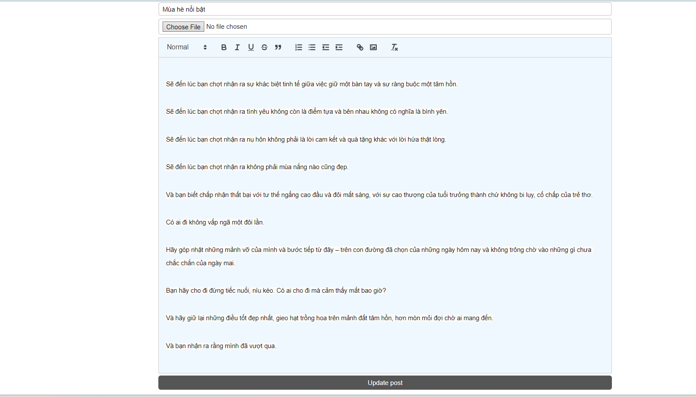

### blog sau khi update 

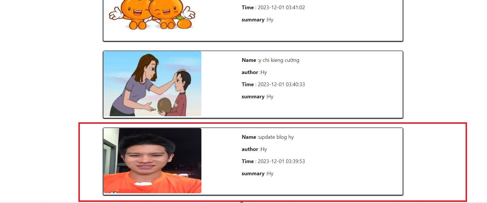

### tao comment 
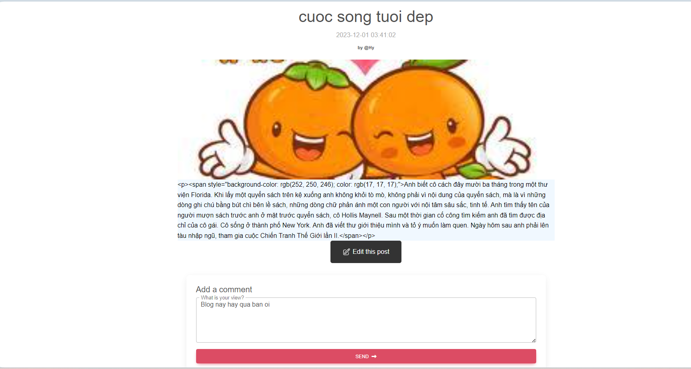

### them comment thanh cong
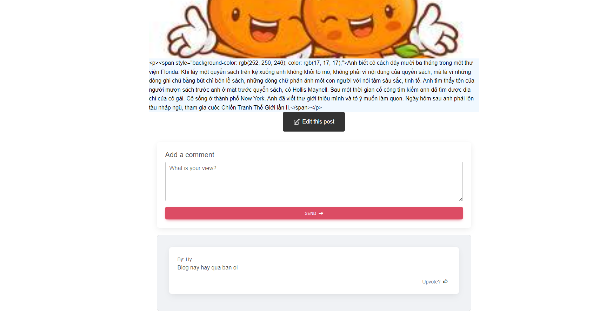
### Guides

The following guides illustrate how to use some features concretely:

* [Building a RESTful Web Service](https://spring.io/guides/gs/rest-service/)

### Additional Links

